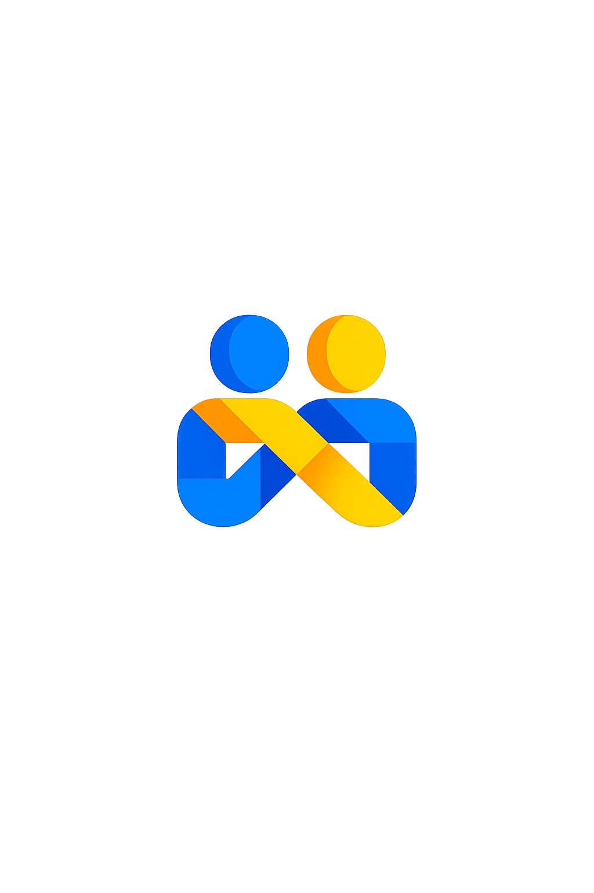

# RELIO

Plateforme intelligente d'attribution automatisée des prestataires de services du quotidien en Afrique urbaine.

> « Décrivez votre problème. Relio trouve la bonne personne pour le résoudre. »

RELIO comprend une demande exprimée en langage naturel (texte ou voix), la classifie, puis attribue automatiquement le professionnel le plus pertinent selon un score dynamique (Score Relio) combinant compétence, disponibilité, distance, réputation et historique. Le MVP cible Douala et Yaoundé (Cameroun).

<p align="center"></p>


## Structure du repo

```
relio/
├── .github/                # GitHub Actions workflows
├── apps/
│   ├── admin-dashboard/   # Dashboard administrateur (React + Vite)
│   └── mobile/            # Application Client & Prestataire (React Native / Expo)
├── backend/                # API centrale (Django + DRF), moteur d'attribution, intégrations
├── docs/                   # Documentation produit et technique
├── scripts/                # Scripts utilitaires (setup, seed, etc.)
├── docker-compose.yml
└── .gitignore
```

## Stack technique

| Composant | Technologie |
|---|---|
| Application mobile | React Native (Expo) |
| Dashboard administrateur | React.js + Vite |
| Backend / API | Django + Django REST Framework |
| Base de données | PostgreSQL |
| Notifications | Firebase Cloud Messaging |
| Paiement | MTN Mobile Money, Orange Money |

## Démarrage rapide

### Prérequis
- Node.js (LTS)
- Python 3.10+
- PostgreSQL
- Docker & Docker Compose (recommandé)

### Avec Docker

```bash
docker-compose up --build
```

### Backend (sans Docker)

```bash
cd backend
python3 -m venv venv
source venv/bin/activate
pip install -r requirements/dev.txt
python manage.py migrate
python manage.py runserver
```

### Dashboard administrateur

```bash
cd apps/admin-dashboard
npm install
npm run dev
```

### Application mobile

```bash
cd apps/mobile
npm install
npx expo start
```

## Documentation
La documentation produit et technique complète (cahier des charges, annexe technique, modèle de données) se trouve dans [`docs`](./docs).
La **Product & UX Bible** (spécification fonctionnelle détaillée) est disponible dans [`docs/product_ux_bible/Product_UX_Bible.md`](./docs/product_ux_bible/Product_UX_Bible.md).
La **Design System** (spécification de design détaillée) est disponible dans [`docs/design_system/Design_System.md`](./docs/design_system/Design_System.md).
## Licence

Voir [LICENSE](./LICENSE).